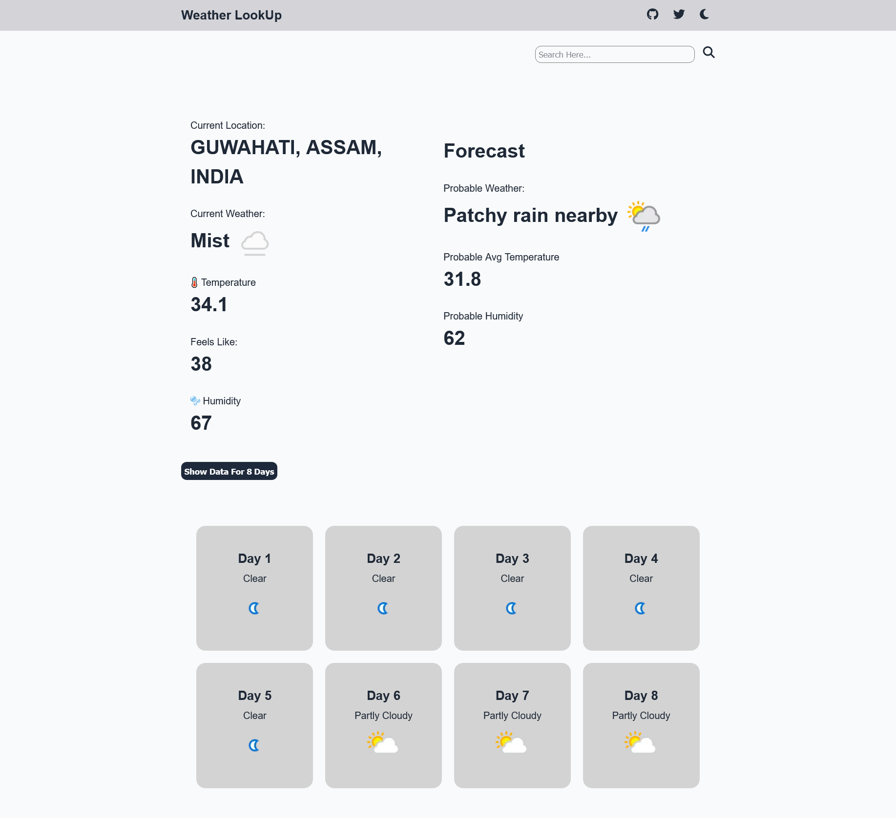

# Weather LookUp

A sleek, responsive weather forecast web application that allows users to search for current and 8-day forecast weather data of any location worldwide. The app fetches real-time data using the [WeatherAPI](https://www.weatherapi.com/) and includes features like location suggestions, a loading screen, and a dark mode toggle.

---

## Screenshots



-   Homepage with current weather
-   Search suggestions dropdown
-   8-day forecast view
-   Dark mode activated

---

## Features

-   **Current Weather Data:** Displays temperature, feels like temperature, humidity, and weather condition with icons.
-   **8-Day Forecast:** Shows a detailed 7 to 8-hourly weather forecast including probable weather, temperature, and humidity.
-   **Location Autocomplete:** Provides search suggestions as you type based on partial location input.
-   **Geolocation Support:** Automatically detects your current location and shows local weather on page load (with permission).
-   **Dark Mode Toggle:** Switch between light and dark themes with a single click.
-   **Loading Screen:** Shows a spinner and message while fetching data.
-   **Responsive Design:** Optimized UI layout for various screen sizes.
-   **Error Handling:** User-friendly error messages for invalid or unavailable locations.

---

## Installation & Usage

1. **Clone the repo:**

    ```bash
    git clone https://github.com/your-username/weather-lookup.git
    cd weather-lookup
    ```

2. **Obtain a WeatherAPI key:**

    - Sign up at [WeatherAPI.com](https://www.weatherapi.com/) and get your free API key.

3. **Add your API key:**

    - Replace the `API_KEY` value in `app.js` with your own key.

4. **Open `index.html` in your browser:**

    - You can directly open the file or use a local server for better experience.

5. **Start exploring!**

---

## Technical Details

-   **API:** WeatherAPI (forecast and location search endpoints)
-   **Languages:** HTML5, CSS3, JavaScript (ES6+)
-   **Features Implemented:**

    -   `fetch` API for asynchronous data retrieval
    -   Promises & async/await syntax
    -   Geolocation API for detecting user location
    -   DOM manipulation to dynamically update UI
    -   Event listeners for search input, button clicks, and theme toggle
    -   Debounced input with autocomplete suggestions

---

## Future Enhancements

-   Add unit toggle (Celsius/Fahrenheit)
-   Improve accessibility and keyboard navigation
-   Add hourly forecast graphs or charts
-   Implement caching for API responses to reduce calls
-   Add localization and multi-language support

---

## Credits

-   Developed by [Bhargab Bhuyan](https://github.com/bhargablinx)
-   Weather data provided by [WeatherAPI.com](https://www.weatherapi.com/)
-   Icons by [FontAwesome](https://fontawesome.com/)

---
